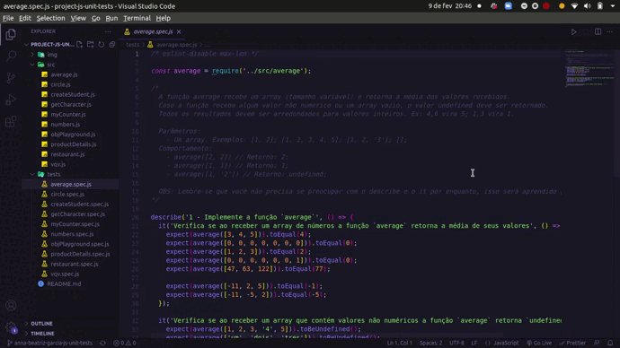

Este projeto contém os requisitos realizados por _[Anna Beatriz Garcia Trajano de Sá](www.linkedin.com/in/anna-beatriz-trajano-de-sá)_ enquanto estudava na [Trybe](https://www.betrybe.com/) :rocket:

# Project Unit Tests

Implementei inúmeras funções para atender aos requisitos propostos e/ou testes unitários para garantir que as implementações das funções estavam corretas.

Veja o exemplo a seguir do layout do projeto!

## Demo

## Habilidades Desenvolvidas

Neste projeto, desenvolvi as seguintes habilidades:

- Escrever testes unitários para funções utilizando o módulo Jest do NodeJS para verificar o correto funcionamento dessas funções;
- A partir de testes já implementados, escrever funções de forma que elas atendam aos testes propostos;
- Escrever testes e funções utilizando uma abordagem de desenvolvimento orientado a testes.

## Escopo do Projeto

- [Requisitos do projeto](#requisitos-do-projeto)
- [x] [1. Implemente a função `average`](#1-implemente-a-função-average)
- [x] [2. Implemente os casos de teste para a função `numbers`](#2-implemente-os-casos-de-teste-para-a-função-numbers)
- [x] [3. Implemente a função `vqv`](#3-implemente-a-função-vqv)
- [x] [4. Implemente os casos de teste para a função `circle`](#4-implemente-os-casos-de-teste-para-a-função-circle)
- [x] [5. Implemente a função `createStudent`](#5-implemente-a-função-createstudent)
- [x] [6. Implemente os casos de teste para a função `productDetails`](#6-implemente-os-casos-de-teste-para-a-função-productdetails)
- [x] [7. Implemente as funções `calculator` e `arrayGenerator`](#7-implemente-as-funções-calculator-e-arraygenerator)
- [x] [8. Implemente a função `myCounter`](#8-implemente-a-função-mycounter)
- [x] [9. Implemente os casos de teste para a função `getCharacter`](#9-implemente-os-casos-de-teste-para-a-função-getcharacter)
